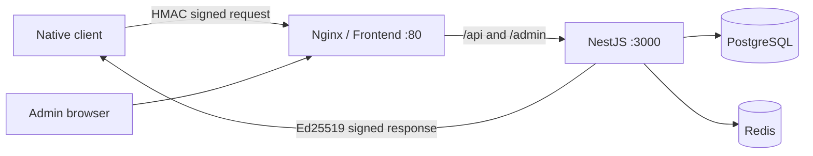

<div align="center">

# Keyline · Card Verification

**A self-hosted license-key platform for issuing, activating, binding, and verifying software licenses.**<br>
**可自行部署的軟體授權平台：發卡、啟用、綁機、驗證與管理，一套完成。**

[繁體中文](#繁體中文) · [English](#english)

`Vue 3` · `NestJS` · `PostgreSQL` · `Redis` · `Docker Compose`

</div>

---

## Project map / 專案導覽

```text
cardverify/
├─ frontend/           Vue 3 + Element Plus admin console
├─ backend/            NestJS API + Prisma
├─ client-example/     Request signing and verification examples
├─ docker-compose.yml  Production container stack
├─ deploy.sh           SSH deployment helper (Linux / WSL)
└─ .env.example        Environment-variable template
```



---

# 繁體中文

## 這是什麼？

Keyline 是一套面向桌面程式或原生客戶端的授權卡密系統。管理者可以批量建立卡密、設定有效天數、綁定裝置、查看在線狀態，以及封禁、解封與解綁。客戶端透過簽章請求啟用或驗證卡密，伺服器則以 Ed25519 簽署回應。

### 主要能力

- **授權週期**：未使用、使用中、已過期、已封禁；支援限時卡與永久卡。
- **HWID 綁機**：一卡一機，管理員可保留剩餘時間並解除綁定。
- **會話監測**：心跳、在線狀態與多開頂號策略。
- **管理後台**：批量產卡、搜尋、篩選、排序、加時、CSV 匯出與統計儀表板。
- **雙向驗證**：請求使用 HMAC-SHA256；回應使用 Ed25519。
- **容器化部署**：前端、後端、PostgreSQL 與 Redis 由 Docker Compose 管理。

## 部署方式一：全新 Docker Compose 部署

### 1. 系統需求

- Linux 伺服器或支援 Docker Desktop 的主機
- Docker Engine 24+ 與 Docker Compose v2
- 建議至少 2 GB RAM、10 GB 可用磁碟空間
- 對外開放一個 HTTP 連接埠，預設為 `8080`

確認環境：

```bash
docker --version
docker compose version
git --version
```

### 2. 取得專案

```bash
git clone https://github.com/JackChenAB/cardverify.git
cd cardverify
cp .env.example .env
```

### 3. 產生密鑰

主機需要 Node.js 20+；此步驟不需要安裝 npm 套件：

```bash
node backend/scripts/genkeys.js
```

將輸出的以下四個變數填入 `.env`：

```dotenv
APP_SECRET=...
JWT_SECRET=...
ED25519_PRIVATE_KEY=...
ED25519_PUBLIC_KEY=...
```

接著修改至少這些值：

```dotenv
POSTGRES_PASSWORD=請換成高強度資料庫密碼
ADMIN_USERNAME=admin
ADMIN_PASSWORD=請換成高強度管理員密碼
HTTP_PORT=8080
```

> `ED25519_PRIVATE_KEY`、`APP_SECRET`、`JWT_SECRET` 與資料庫密碼不可提交到 Git。正式環境第一次啟動後，請保持密鑰穩定；更換 Ed25519 金鑰時也要同步更新所有客戶端公鑰。

### 4. 準備 Docker 網路

`docker-compose.yml` 會把前端加入外部網路 `npm_bridge`，供 Nginx Proxy Manager 或其他反向代理使用。第一次部署先建立一次：

```bash
docker network inspect npm_bridge >/dev/null 2>&1 || docker network create npm_bridge
```

### 5. 建置並啟動

```bash
docker compose up -d --build
docker compose ps
```

預期四個服務都為 `Up`，其中資料庫應顯示 `healthy`：

```text
verify-backend-1    Up
verify-db-1         Up (healthy)
verify-frontend-1   Up    0.0.0.0:8080->80/tcp
verify-redis-1      Up
```

瀏覽器開啟 `http://SERVER_IP:8080`，使用 `.env` 中的 `ADMIN_USERNAME` 與 `ADMIN_PASSWORD` 登入。

### 6. 驗證部署

```bash
curl -I http://127.0.0.1:8080/
docker compose logs --tail=100 backend
docker compose logs --tail=100 frontend
```

若變更了 `HTTP_PORT`，請同步修改 `curl` 的連接埠。

## 部署方式二：Dockge

1. 在 Dockge 建立名為 `verify` 的 Stack。
2. Stack 目錄建議使用 `/opt/stacks/verify`。
3. 將專案放入該目錄，並把 `docker-compose.yml` 複製為 Dockge 慣用的 `compose.yaml`：

```bash
cd /opt/stacks/verify
cp docker-compose.yml compose.yaml
cp .env.example .env
```

4. 完成 `.env` 與 `npm_bridge` 設定。
5. 在 Dockge 按下 **Deploy**，或在終端執行：

```bash
docker compose up -d --build
```

若使用 Nginx Proxy Manager，將 Proxy Host 指向 `verify-frontend:80`，並確保 Proxy Manager 也連上 `npm_bridge`。

## 從工作站透過 SSH 部署

`deploy.sh` 會把原始碼傳到遠端、建立或沿用本機 `prod.env`，再於遠端執行 Docker Compose。腳本依賴 Linux 工具，建議從 Linux 或 WSL 執行。

```bash
chmod +x deploy.sh
read -s -p "SSH / sudo password: " REMOTE_PW && echo
export REMOTE_PW
./deploy.sh user@SERVER_IP /opt/stacks/verify 8080
unset REMOTE_PW
```

參數順序：

```text
./deploy.sh <SSH_USER@HOST> <REMOTE_STACK_DIR> <HTTP_PORT>
```

> 更新既有 Stack 前，請確認本機 `prod.env` 與遠端 `.env` 使用相同密鑰及資料庫設定，避免遠端設定被不同的環境檔覆蓋。

## 更新既有部署

### 在伺服器上以 Git 更新

```bash
cd /opt/stacks/verify
cp .env "$HOME/verify.env.$(date +%Y%m%d-%H%M%S).backup"
git fetch origin
git pull --ff-only origin main
cp docker-compose.yml compose.yaml
docker compose up -d --build
docker compose ps
```

資料庫存在 Docker volume `pgdata`，重建應用容器不會清空資料。更新後仍建議先備份資料庫：

```bash
docker compose exec -T db pg_dump \
  -U "$POSTGRES_USER" "$POSTGRES_DB" \
  > "cardverify-$(date +%Y%m%d-%H%M%S).sql"
```

### 回滾程式版本

```bash
cd /opt/stacks/verify
git log --oneline -10
git checkout <KNOWN_GOOD_COMMIT>
cp docker-compose.yml compose.yaml
docker compose up -d --build
```

恢復完成後可用 `git switch main` 回到主分支。資料庫 Schema 變更前，務必另外保存 PostgreSQL 備份。

## HTTPS 與網域

正式環境建議只讓反向代理對外提供服務：

1. 將網域 DNS 指向伺服器。
2. Nginx Proxy Manager 的 Forward Host 設為 `verify-frontend`，Port 設為 `80`。
3. 啟用 WebSocket Support、Block Common Exploits 與 SSL。
4. 申請 Let’s Encrypt 憑證並啟用 Force SSL。
5. 防火牆只開放 `80`、`443` 與必要的 SSH 來源；PostgreSQL、Redis、NestJS 不應直接暴露到公網。

## 環境變數

| 變數 | 必填 | 預設／範例 | 用途 |
|---|---:|---|---|
| `POSTGRES_USER` | 是 | `cardverify` | PostgreSQL 使用者 |
| `POSTGRES_PASSWORD` | 是 | — | PostgreSQL 密碼 |
| `POSTGRES_DB` | 是 | `cardverify` | 資料庫名稱 |
| `HTTP_PORT` | 否 | `8080` | 前端與 API 的主機連接埠 |
| `ADMIN_USERNAME` | 是 | `admin` | 初始管理員帳號 |
| `ADMIN_PASSWORD` | 是 | — | 初始管理員密碼；只在第一次建立帳號時使用 |
| `APP_SECRET` | 是 | — | 客戶端請求 HMAC 共用密鑰 |
| `JWT_SECRET` | 是 | — | 管理後台 JWT 簽章密鑰 |
| `JWT_EXPIRES_IN` | 否 | `12h` | 管理員登入有效時間 |
| `ED25519_PRIVATE_KEY` | 是 | Base64 PEM | 伺服器回應簽章私鑰 |
| `ED25519_PUBLIC_KEY` | 是 | Base64 PEM | 對應公鑰 |
| `HEARTBEAT_ONLINE_TTL_S` | 否 | `360` | 在線狀態判定秒數 |
| `SESSION_STALE_TTL_S` | 否 | `360` | 舊會話失效秒數 |
| `MULTIOPEN_POLICY` | 否 | `kick-old` | 多開處理策略 |

## 客戶端串接

1. 在客戶端保存 `APP_SECRET` 與 Ed25519 **公鑰 PEM**。
2. 每次請求加入 `x-timestamp`、`x-nonce`、`x-signature`。
3. HMAC-SHA256 的簽章原文為：

```text
METHOD
PATH
TIMESTAMP
NONCE
RAW_BODY
```

4. 收到回應後，先驗證 Ed25519 簽章，再信任 `payload.valid`。
5. 參考 `client-example/verify.js`：

```bash
APP_SECRET=xxx SERVER_PUBLIC_KEY_PEM="$(cat pub.pem)" \
  node client-example/verify.js activate \
  ABCD-EF23-GHJK-LMNP HW-001 http://localhost:8080
```

### 客戶端 API

| Method | Path | Body | 說明 |
|---|---|---|---|
| `POST` | `/api/v1/activate` | `{code, hwid}` | 首次啟用、綁機並開始計時 |
| `POST` | `/api/v1/verify` | `{code, hwid, session?, takeover?}` | 心跳驗證與多開控制 |

常見 `result`：`OK`、`NOT_FOUND`、`BANNED`、`EXPIRED`、`HWID_MISMATCH`、`NOT_ACTIVATED`、`CONCURRENT_SESSION`。

## 本機開發

```bash
# Terminal 1 — backend
cd backend
npm ci
npm run test
npm run start:dev

# Terminal 2 — frontend
cd frontend
npm ci
npm run dev
```

前端開發伺服器位於 `http://localhost:5173`，並將 `/admin` 與 `/api` 代理到 `http://localhost:3000`。

### Demo UI（不啟動後端）

```bash
cd frontend
VITE_DEMO=1 npm run dev
```

### 常用檢查

```bash
npm --prefix backend run test
npm --prefix backend run build
npm --prefix frontend run build
docker compose config -q
```

## 疑難排解

| 問題 | 檢查方式 |
|---|---|
| `network npm_bridge declared as external, but could not be found` | 執行 `docker network create npm_bridge` |
| 前端顯示 `502 Bad Gateway` | 執行 `docker compose ps`，再查看 `docker compose logs backend` |
| 資料庫一直不是 healthy | 檢查 `.env` 的 PostgreSQL 設定與 `docker compose logs db` |
| 登入密碼修改後無效 | 初始帳號只在第一次建立；確認既有資料庫中的管理員帳號 |
| 客戶端收到簽章錯誤 | 確認客戶端公鑰對應目前的 `ED25519_PRIVATE_KEY` |
| 更新後仍看到舊介面 | 執行 `docker compose build --no-cache frontend && docker compose up -d frontend` |

---

# English

## What is this?

Keyline is a self-hosted license-key service for desktop and native applications. Administrators can issue license keys, define validity periods, bind devices, monitor sessions, and revoke or restore access. Clients send signed activation or verification requests, and the server signs every response with Ed25519.

### Highlights

- Timed and permanent licenses with complete lifecycle states.
- One-device-per-license HWID binding and administrative unbinding.
- Heartbeats, online presence, and concurrent-session control.
- Polished admin console with batch issuance, filtering, CSV export, and analytics.
- HMAC-SHA256 request authentication and Ed25519 response verification.
- Reproducible deployment with Docker Compose.

## Option 1: Fresh Docker Compose deployment

### 1. Requirements

- Linux server or a machine running Docker Desktop
- Docker Engine 24+ and Docker Compose v2
- At least 2 GB RAM and 10 GB free disk space recommended
- One public HTTP port; the default is `8080`

```bash
docker --version
docker compose version
git --version
```

### 2. Clone and configure

```bash
git clone https://github.com/JackChenAB/cardverify.git
cd cardverify
cp .env.example .env
node backend/scripts/genkeys.js
```

Copy the generated `APP_SECRET`, `JWT_SECRET`, `ED25519_PRIVATE_KEY`, and `ED25519_PUBLIC_KEY` lines into `.env`. Then set strong values for `POSTGRES_PASSWORD` and `ADMIN_PASSWORD` and choose `HTTP_PORT`.

Never commit `.env`. Keep production signing keys stable after the first launch; rotating the Ed25519 pair also requires updating the public key embedded in every client.

### 3. Create the proxy network

The Compose file expects an external `npm_bridge` network for reverse-proxy integration:

```bash
docker network inspect npm_bridge >/dev/null 2>&1 || docker network create npm_bridge
```

### 4. Build and start

```bash
docker compose up -d --build
docker compose ps
curl -I http://127.0.0.1:8080/
```

Open `http://SERVER_IP:8080` and sign in with `ADMIN_USERNAME` and `ADMIN_PASSWORD` from `.env`.

## Option 2: Dockge

1. Create a Dockge stack named `verify`.
2. Use `/opt/stacks/verify` as the stack directory.
3. Place this repository in that directory.
4. Copy `docker-compose.yml` to `compose.yaml` and create `.env`:

```bash
cd /opt/stacks/verify
cp docker-compose.yml compose.yaml
cp .env.example .env
```

5. Configure `.env`, create `npm_bridge`, and click **Deploy** in Dockge.

For Nginx Proxy Manager, forward the host to `verify-frontend:80` and attach the proxy container to `npm_bridge`.

## Deploy over SSH

`deploy.sh` uploads the source tree and runs the build on the remote Docker host. Run it from Linux or WSL because it relies on standard Linux utilities.

```bash
chmod +x deploy.sh
read -s -p "SSH / sudo password: " REMOTE_PW && echo
export REMOTE_PW
./deploy.sh user@SERVER_IP /opt/stacks/verify 8080
unset REMOTE_PW
```

Arguments:

```text
./deploy.sh <SSH_USER@HOST> <REMOTE_STACK_DIR> <HTTP_PORT>
```

Before updating an existing stack, make sure local `prod.env` matches the remote `.env`; the deployment helper uses `prod.env` as the stack environment file.

## Update an existing installation

```bash
cd /opt/stacks/verify
cp .env "$HOME/verify.env.$(date +%Y%m%d-%H%M%S).backup"
git fetch origin
git pull --ff-only origin main
cp docker-compose.yml compose.yaml
docker compose up -d --build
docker compose ps
```

The PostgreSQL data lives in the `pgdata` Docker volume and survives application-container rebuilds. Back it up before schema-sensitive upgrades:

```bash
docker compose exec -T db pg_dump \
  -U "$POSTGRES_USER" "$POSTGRES_DB" \
  > "cardverify-$(date +%Y%m%d-%H%M%S).sql"
```

### Roll back the application

```bash
cd /opt/stacks/verify
git log --oneline -10
git checkout <KNOWN_GOOD_COMMIT>
cp docker-compose.yml compose.yaml
docker compose up -d --build
```

Run `git switch main` when you are ready to return to the main branch. Keep a separate PostgreSQL dump before changes that alter the schema.

## HTTPS and domain setup

1. Point your domain’s DNS record to the server.
2. In Nginx Proxy Manager, forward to `verify-frontend:80`.
3. Enable WebSocket Support, Block Common Exploits, and SSL.
4. Request a Let’s Encrypt certificate and enable Force SSL.
5. Expose only ports `80`, `443`, and restricted SSH access. Do not publish PostgreSQL, Redis, or the NestJS port directly.

## Environment variables

| Variable | Required | Default / example | Purpose |
|---|---:|---|---|
| `POSTGRES_USER` | Yes | `cardverify` | PostgreSQL user |
| `POSTGRES_PASSWORD` | Yes | — | PostgreSQL password |
| `POSTGRES_DB` | Yes | `cardverify` | Database name |
| `HTTP_PORT` | No | `8080` | Host port for the UI and API |
| `ADMIN_USERNAME` | Yes | `admin` | Initial administrator username |
| `ADMIN_PASSWORD` | Yes | — | Initial password; used when the account is first seeded |
| `APP_SECRET` | Yes | — | Shared key for client-request HMAC |
| `JWT_SECRET` | Yes | — | Signing key for administrator JWTs |
| `JWT_EXPIRES_IN` | No | `12h` | Administrator session lifetime |
| `ED25519_PRIVATE_KEY` | Yes | Base64 PEM | Server response-signing private key |
| `ED25519_PUBLIC_KEY` | Yes | Base64 PEM | Matching public key |
| `HEARTBEAT_ONLINE_TTL_S` | No | `360` | Online-presence window in seconds |
| `SESSION_STALE_TTL_S` | No | `360` | Stale-session timeout in seconds |
| `MULTIOPEN_POLICY` | No | `kick-old` | Concurrent-session policy |

## Client integration

1. Store `APP_SECRET` and the Ed25519 **public PEM key** in the client.
2. Add `x-timestamp`, `x-nonce`, and `x-signature` to every request.
3. Build the HMAC-SHA256 message as:

```text
METHOD
PATH
TIMESTAMP
NONCE
RAW_BODY
```

4. Verify the Ed25519 response signature before trusting `payload.valid`.
5. See `client-example/verify.js` for an executable reference.

| Method | Path | Body | Purpose |
|---|---|---|---|
| `POST` | `/api/v1/activate` | `{code, hwid}` | First activation, device binding, and timer start |
| `POST` | `/api/v1/verify` | `{code, hwid, session?, takeover?}` | Heartbeat verification and concurrent-session control |

Possible `result` values include `OK`, `NOT_FOUND`, `BANNED`, `EXPIRED`, `HWID_MISMATCH`, `NOT_ACTIVATED`, and `CONCURRENT_SESSION`.

## Local development

```bash
# Terminal 1 — backend
cd backend
npm ci
npm run test
npm run start:dev

# Terminal 2 — frontend
cd frontend
npm ci
npm run dev
```

The frontend runs at `http://localhost:5173` and proxies `/admin` and `/api` to `http://localhost:3000`.

Run the UI without the backend:

```bash
cd frontend
VITE_DEMO=1 npm run dev
```

### Validation commands

```bash
npm --prefix backend run test
npm --prefix backend run build
npm --prefix frontend run build
docker compose config -q
```

## Troubleshooting

| Symptom | Resolution |
|---|---|
| `network npm_bridge declared as external, but could not be found` | Run `docker network create npm_bridge` |
| Frontend returns `502 Bad Gateway` | Check `docker compose ps` and `docker compose logs backend` |
| Database never becomes healthy | Verify PostgreSQL values in `.env` and inspect `docker compose logs db` |
| A changed admin password has no effect | The initial account is seeded once; verify the administrator stored in the existing database |
| Client signature validation fails | Confirm that the embedded public key matches the current `ED25519_PRIVATE_KEY` |
| The old UI remains after an update | Run `docker compose build --no-cache frontend && docker compose up -d frontend` |

---

## Maintainer notes

- Keep `.env`, `prod.env`, database dumps, and private keys outside commits.
- Review `docker compose ps` and service logs after every deployment.
- Update both language sections when deployment behavior changes.
- Use Issues for reproducible bug reports and include Docker/Compose versions, relevant logs, and exact reproduction steps.
